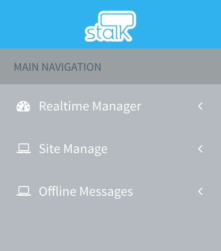
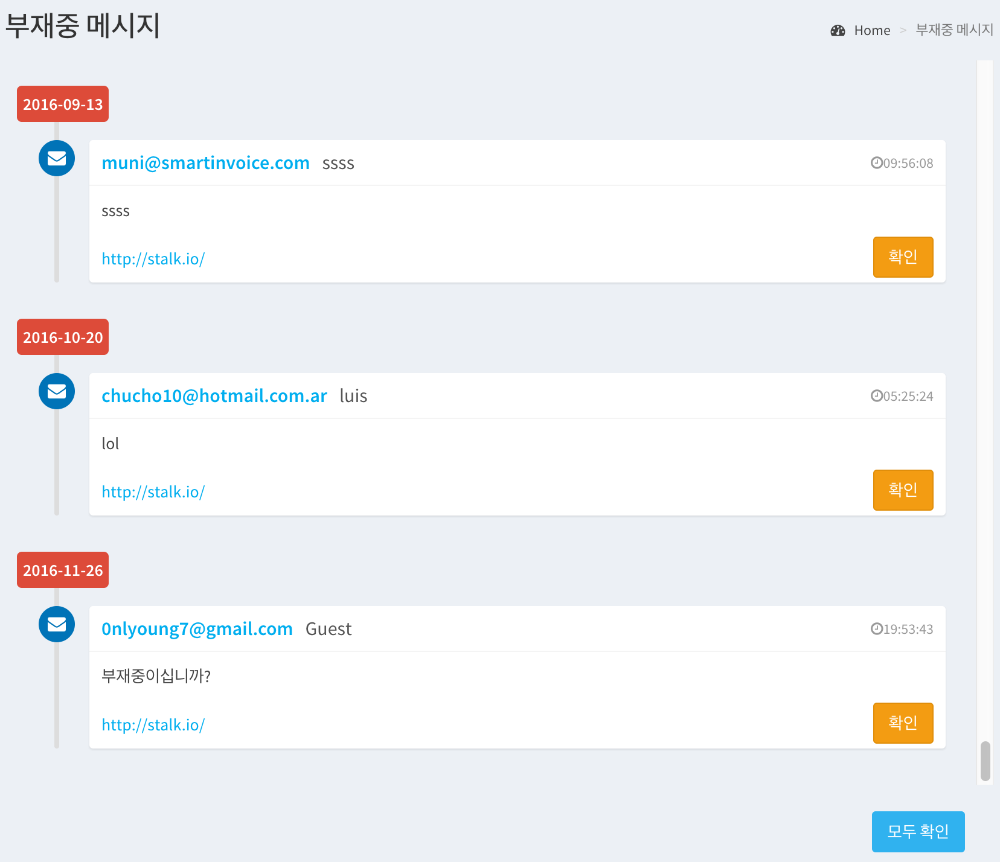

Offline Messages
======================

If the counselor is not a state that can be consultation, customers can leave a message along with the e-mail address.

This menu can read out of office messages

### 1. Select menu 

Click the Offline Messages Menu in Main Navigation

### 2. Retrieve message 

Check the list of out-of-office message.

### 3. Confirm Message

When you click the right of `Read` button for each message, You can change the state of the message to `read`

When you click the `Read All` button in lower right side, You can change the states of all messages to `read`

> In the case of the message in the `read` state, it does not appear in the lists at your the next connection