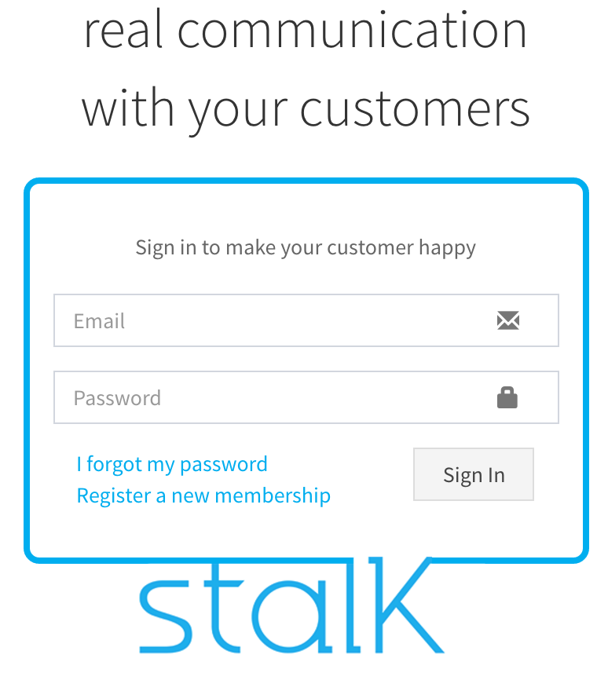
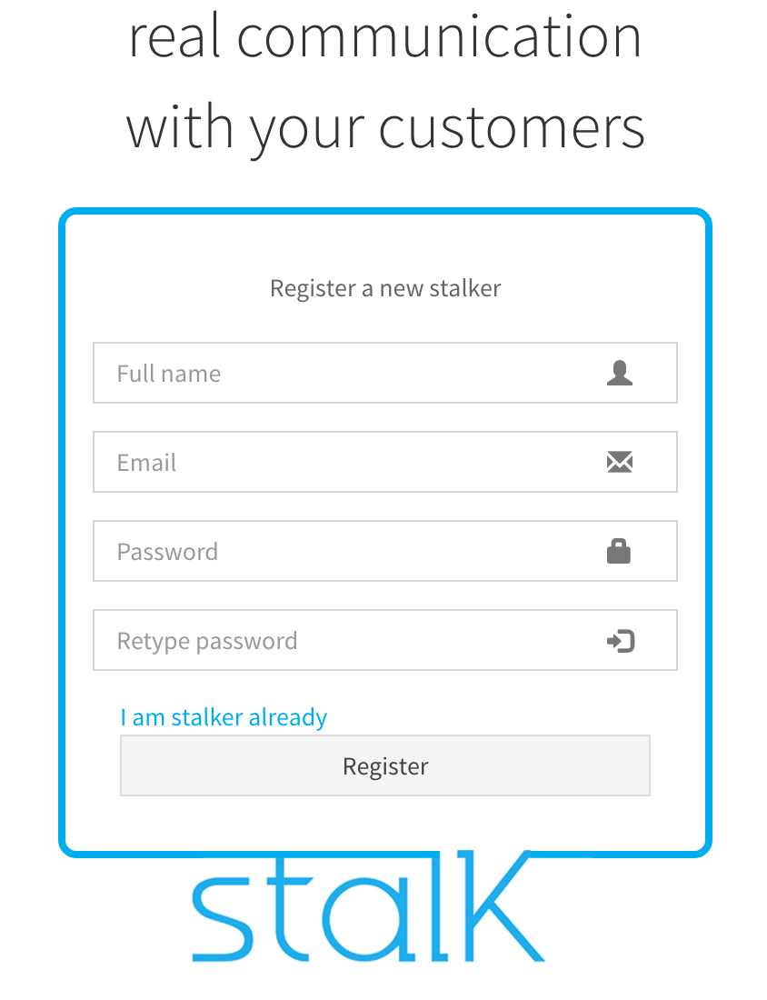

User registration
======================

1. Connect to localhost:9000
 - If you using our cloud service, connect to admin.stalk.io:9000 instead

2. Click the link Register a new membership.

3. Input Name, Email, Password and submit

4.login with registered user and start the service.