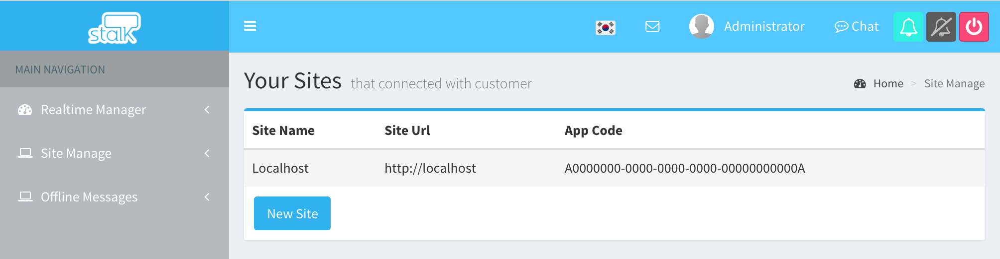
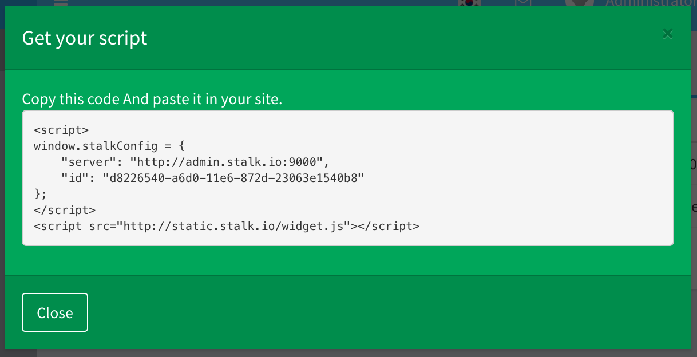

Site Manage
======================

1. Click the Site Manage Menu in Left Main Navigation.

2. Click the `New Site` button.

3. Input the site name and site Url, and then click the `Add Site` button

Site Url must be entered exactly start with `http://`

** It is important to accurately input the URL **

4. Pease add the script to the bottom of the page of the site to be applied

