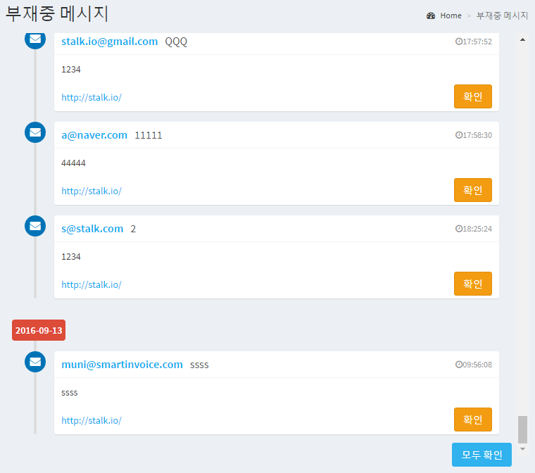

부재중 메시지
======================

상담원이 상담이 가능한 상태가 아닌 경우, 고객은 메일주소와 함께 메세지를 남길 수 있습니다.

부재 중 일때 고객이 남긴 메세지를 확인할 수 있는 메뉴입니다.

1. 좌측 Main Navigation에서 Offline Messages 메뉴를 클릭합니다.

2. 부재중 메시지 리스트를 확인합니다.

3. 각 메시지 우측의 `확인` 버튼을 클릭하면, 해당 메세지를 `읽음` 상태로 변경할 수 있습니다.

4. 우측 하단의 `모두 확인` 버튼을 클릭하면, 모든 메세지를 `읽음` 상태로 변경할 수 있습니다.

** 읽음 상태의 메세지의 경우 다음 번 접속 시에 메시지 리스트에 나타나지 않습니다. **.

