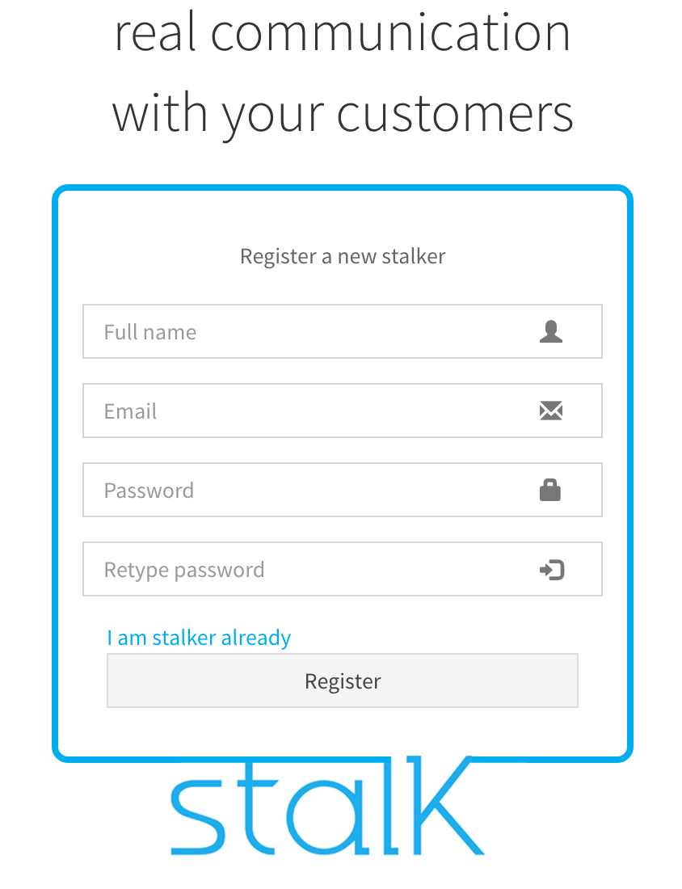

사용자 등록
======================

### 1. 접속 및 이동

[io.stalk.admin](https://github.com/xpush/io.stalk.admin)을 설치한 경우, *http://YourIP:9000*에 접속합니다.

> 클라우드 서비스를 사용 중인 경우, http://admin.stalk.io:9000에 접속합니다.

Register a new membership 버튼을 클릭합니다.

### 2. 회원가입을 위한 정보 입력

Name, Email, Password를 입력하고 Register 버튼을 클릭합니다.

### 3. 로그인

가입이 완료되면 가입 ID로 로그인을 해서 서비스를 시작합니다.