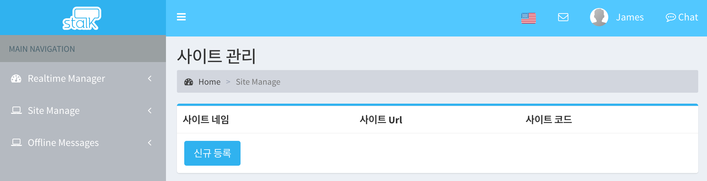
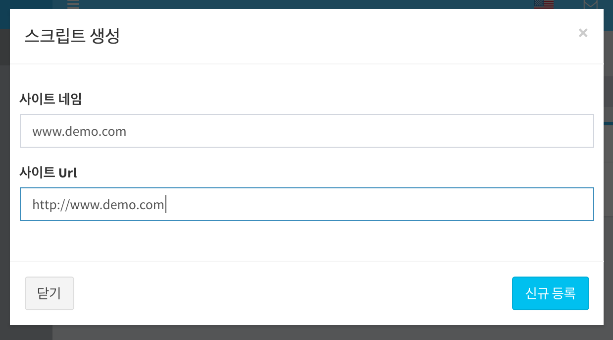
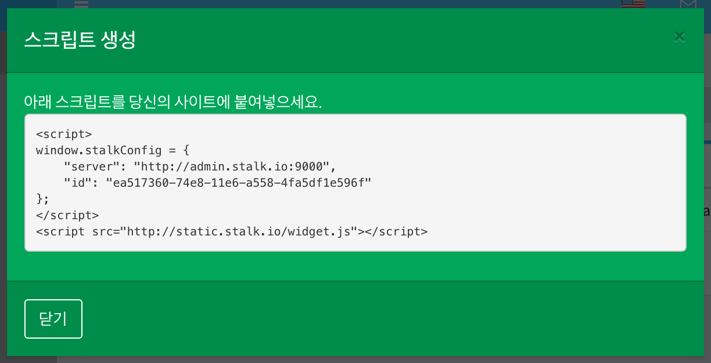
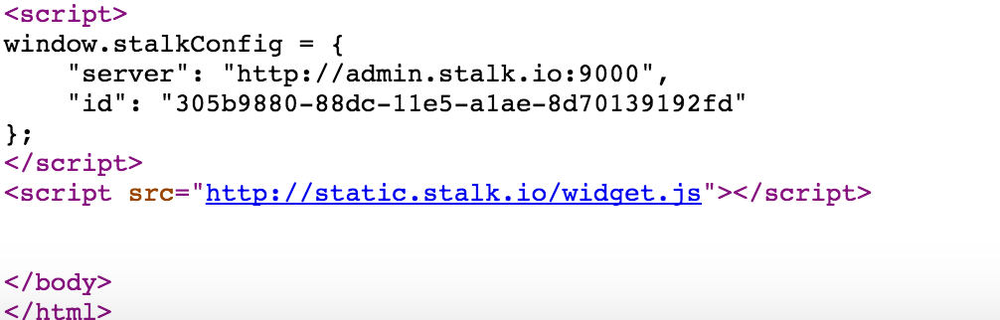

사용자 등록
======================

1. 좌측 Main Navigation에서 Site Manage 메뉴를 클릭합니다.

2. `신규 등록` 버튼을 클릭합니다.

3. 사이트 네임과 사이트 Url을 입력하고 `신규 등록` 버튼을 클릭합니다.

사이트 Url은 `http://`로 시작되도록 정확하게 입력해야합니다.

** 사이트를 등록하거나 수정할 때 URL을 정확히 입력하는 것** 이 중요합니다.

4. 아래의 스크립트 코드를, 적용할 사이트의 페이지 하단에 추가해주세요.

