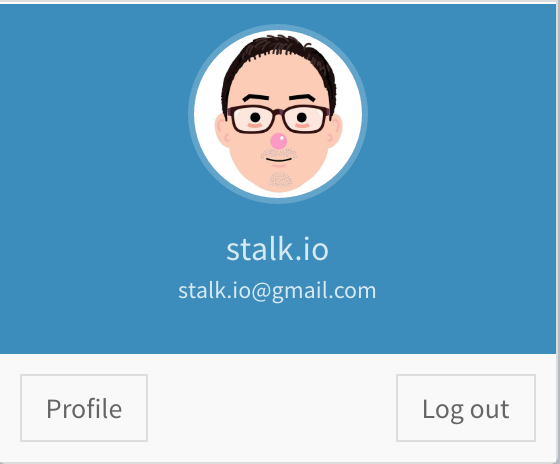

상단 네비게이션 메뉴
======================

우측 상단 네비게이션 메뉴에는 7개의 버튼이 존재합니다.

### 1. 국기버튼

성조기 버튼을 클릭하면, 사이트의 표시 언어가 영문으로 변경됩니다. 
반대로 태극기 클릭하면, 사이트의 표시 언어가 한글로 변경됩니다.

### 2. 메일 버튼

읽지 않은 메세지 갯수를 표시합니다.
클릭하면 메시지 리스트를 확인할 수 있습니다.

### 3. 프로필 버튼
 
현재 접속한 사용자의 프로필 정보를 확인할 수 있습니다.

### 4. Chat icon

채팅 메인 화면으로 이동합니다.

### 5. 알림 on 버튼
채팅 가능상태로 변경합니다.

### 6. 알림 off 버튼

잠시 채팅을 할 수 없는 경우, 상태를 부재중으로 변경합니다.
부재중 상태인 경우, 고객에게 받은 메시지는 오프라인 메시지 화면에서 확인할 수 있습니다.

### 7. 로그아웃 버튼

로그아웃하고 접속을 종료합니다.